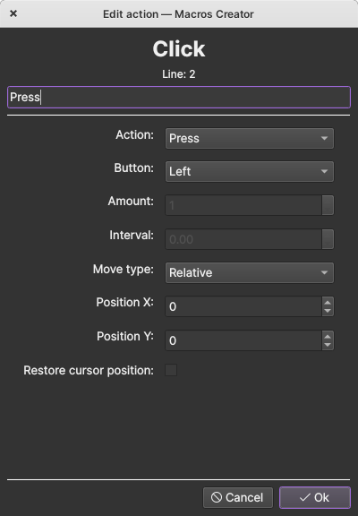

# Macros Creator

Simple application for creating macros

Build app with PyInstaller:

### Linux / MacOS

`pyinstaller --onefile -w --add-data "gui/icons/.:." main.py`

### Windows

`pyinstaller --onefile -w --add-data "gui/icons/.;." main.py`

Icons: [Breeze icon theme](https://github.com/KDE/breeze-icons)