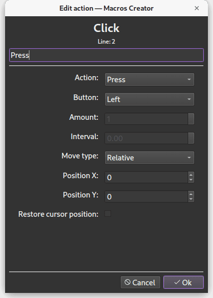

# Macros Creator

Simple application for creating macros for mouse and keyboard

#### Features:

* Click
* Move cursor
* Press Key
* Write Text
* Pause
* Loops
* Absolute / Relative mouse positioning

  

### Build app with PyInstaller:

#### Linux / MacOS

`pyinstaller --onefile --name macros_creator --noconsole --add-data "gui/icons/.:." main.py`

#### Windows

`pyinstaller --onefile --name macros_creator --noconsole --add-data "gui/icons/.;." main.py`

Icons: [Breeze icon theme](https://github.com/KDE/breeze-icons)